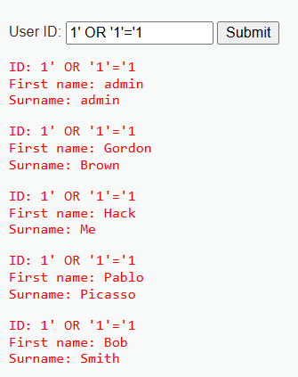
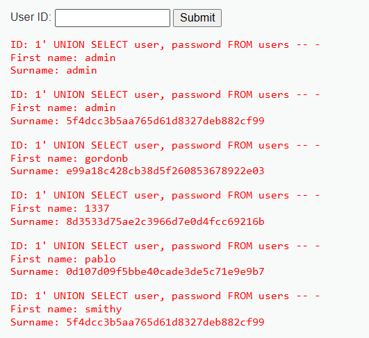

# SQL Injection – User ID Parameter (DVWA)

## Description
The `User ID:` parameter in DVWA's SQL Injection page is vulnerable to SQL Injection.
By injecting a crafted payload, an attacker can retrieve all user records from the database without authorization.

## Reproduction Steps
1. Navigate to **Vulnerabilities → SQL Injection**.
2. In the **User ID** field, enter: 1' OR '1'='1
3. Click **Submit**.
4. **Observed result**: The application returns all user records, bypassing the intended single-record restriction.

### Screenshots


## Impact
- An attacker can retrieve all user records, including usernames and potentially hashed passwords.
- This bypasses access control and confidentiality protections.

## Escalated Impact
The attacker can actually even gather the hashed DB user passwords, using a UNION query and guessing the names of other tables:

```sql
1' UNION SELECT user, password FROM users -- -
```



## Root Cause
The application concatenates unvalidated user input - $id below - into the SQL query directly:

```php
$id = $_REQUEST[ 'id' ];

switch ($_DVWA['SQLI_DB']) {
    case MYSQL:
        // Check database
        $query  = "SELECT first_name, last_name FROM users WHERE user_id = '$id';";
        $result = mysqli_query(
            $GLOBALS["___mysqli_ston"],  
            $query
        ) or die(
            '<pre>' . (
                (is_object($GLOBALS["___mysqli_ston"])) 
                ? mysqli_error($GLOBALS["___mysqli_ston"]) 
                : (($___mysqli_res = mysqli_connect_error()) ? $___mysqli_res : false)
            ) . '</pre>'
        );
        [...]
```
This means that if the attacker sends a crafted input that always returns True (hence the OR '1'='1) he will be able to return all rows from the DB table.

## Patch

There are multiple ways to patch a query that is vulnerable to SQL Injection.
This project uses [prepared statements](https://cheatsheetseries.owasp.org/cheatsheets/SQL_Injection_Prevention_Cheat_Sheet.html).

See patches/dvwa/sqli/low.php for the patched file 

## Score

**CVSS v3.1 Base Score**: 7.5 (High)  
Vector: `AV:N/AC:L/PR:N/UI:N/S:U/C:H/I:N/A:N`