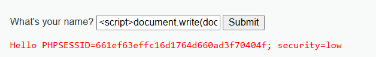

# XSS Reflected

## Description
The `What's your name?` field in DVWA fails to properly check user input before reflecting it back into the page.  
This allows malicious JavaScript to be injected and executed in the context of the victim’s browser.

## Reproduction Steps
1. Navigate to the **XSS (Reflected)** module in DVWA.
2. In the input field, enter the following payload:
   ```html
   <script>alert('XSS Test');</script>
3. Observe that the browser executes the injected JavaScript instead of treating it as plain text.
4. A more interesting payload would be one that can gather the user sessoin cookies, such as:
   ```html
   <script>document.write(document.cookie)</script>




## Impact
This allows an attacker to:
- Steal session cookies
- Perform unauthorized actions as the victim
- Redirect victims to malicious pages

## Root Cause
The code directly concatenates the user input into the html response, as seen here:

```php
// Is there any input?
if( array_key_exists( "name", $_GET ) && $_GET[ 'name' ] != NULL ) {
	// Feedback for end user
	$html .= '<pre>Hello ' . $_GET[ 'name' ] . '</pre>';
}
```
`name` is sent into the response, without any validation or encoding, which is why we are able to inject JS code that gets reflected.

## Patch

[Output Encoding](https://cheatsheetseries.owasp.org/cheatsheets/Cross_Site_Scripting_Prevention_Cheat_Sheet.html#output-encoding) guarantees that the input will be safely encoded before being reflected in the response.

See patches/dvwa/xss_r/low.php for a fix

## Score

**CVSS v3.1 Base Score**: 9.6 (Critical)  
Vector: `/AV:N/AC:L/PR:N/UI:R/S:C/C:H/I:H/A:L`